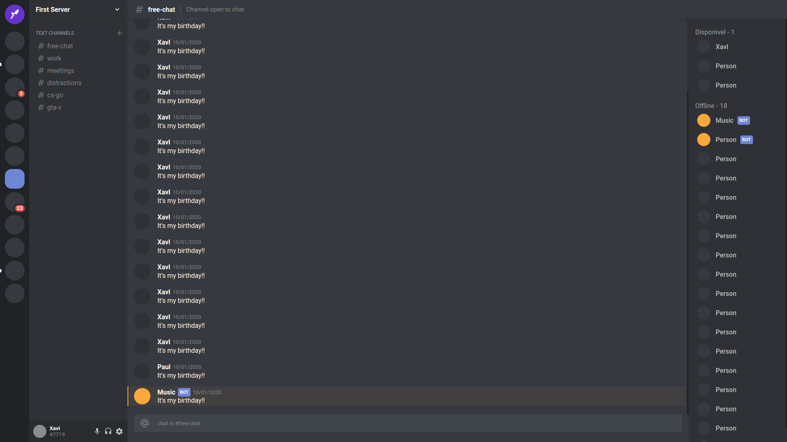

<h1 align="center">
    
</h1>

<h1 align="center">
    
</h1>

# Indice

- [Sobre](#-sobre)
- [Tecnologias Utilizadas](#-tecnologias-utilizadas)
- [Como baixar o projeto](#-como-baixar-o-projeto)

## 🔖&nbsp; Sobre

O projeto **Clone** **Discord** foi criado com a intensão de praticar e aprender mais sobre as tecnologias utilizadas. Todo o projeto foi desenvolvido orientado, pela Rocketseat, através do seu canal de Youtube.

---

## 🚀 Tecnologias utilizadas

O projeto foi desenvolvido utilizando as seguintes tecnologias

- [React Native](https://reactnative.dev/)
- [TypeScript](https://www.typescriptlang.org/)

---

## 🗂 Como baixar o projeto

```bash

    # Clonar o repositório
    $ git clone https://github.com/Xavi002/Clone-Discord

    # Entrar no diretório
    $ cd clone-discord

    # Instalar as dependências
    $ yarn install

    # Iniciar o projeto
    $ yarn start
```

---

Desenvolvido por Diogo Martins